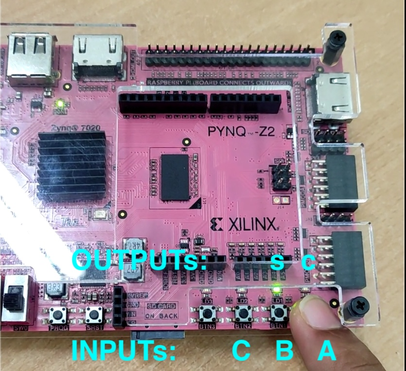
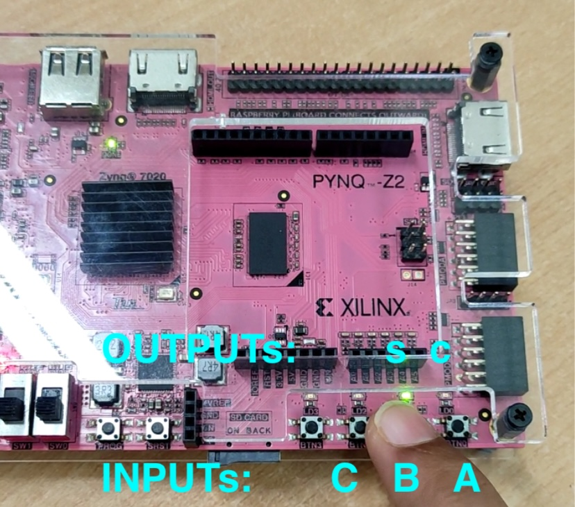
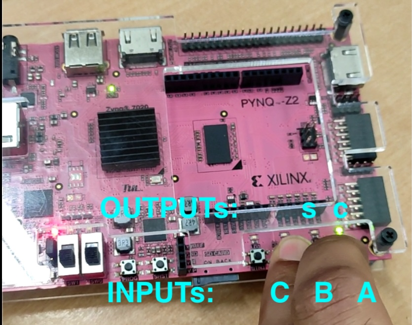
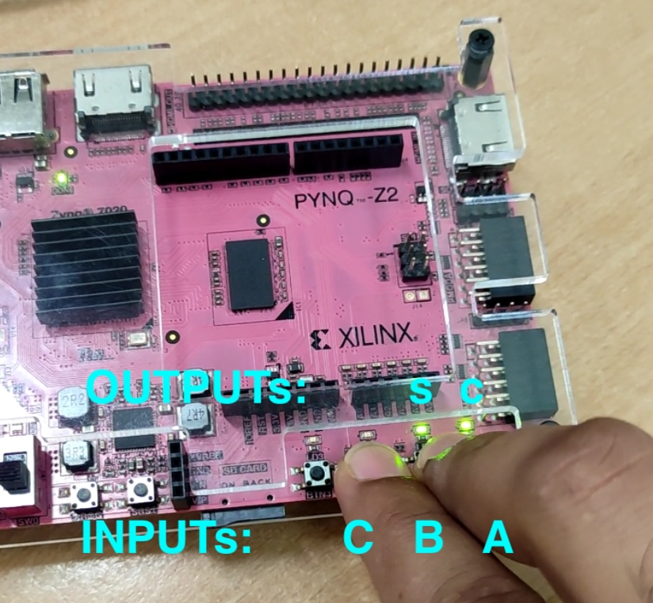

# Full-Adder-PYNQ-Z2
A basic Full Adder implemented on Xilinx PYNQ-Z2 FPGA Board.
The project employs its inbuilt buttons as the I/P while the inbuilt LEDs as the O/P SUM & CARRY.

# Functionality Demonstration on the PYNQ-Z2 FPGA Board

  
  

  
  

# LUT Utilisation

  

